# Mandilah-Singapura: Slightly Unhinged Currency Analysis 
*(Because someone has to figure out whether the Ringgit is finally going to grow up or keep acting like that cousin who still owes you RM50 from 2012)*

### Project Tagline  
"Tracking two currencies that are basically siblings who refuse to admit they look alike."

## MYR Forecast End-2026

```mermaid
graph TD
    A[MYR Forecast End-2026] --> B[Optimistic - Strengthening]
    A --> C[Neutral - Stable]
    A --> D[Pessimistic - Weakening]
    
    B --> B1["MYR/USD: 3.93-4.04<br/>Sources: MARC Ratings, OCBC"]
    B --> B2["MYR/SGD: 3.045-3.087<br/>Sources: LongForecast, AUDToday"]
    B --> B3["Probability: 60-70%<br/>Drivers: Fiscal reforms,<br/>5%+ GDP growth, softer USD<br/>Note: Temp weakness to ~4.18<br/>end-2025, then rebound"]
    
    C --> C1["MYR/USD: ~4.10-4.20<br/>Sources: Bloomberg strategists"]
    C --> C2["MYR/SGD: ~3.21<br/>Sources: Traders Union"]
    C --> C3["Probability: 40-50%<br/>Resilient fundamentals offset<br/>risks: oil volatility, US tariffs"]
    
    D --> D1["MYR/USD: >4.20<br/>If USD rebounds"]
    D --> D2["MYR/SGD: 3.21+<br/>Sources: WalletInvestor,<br/>Reddit long-term"]
    D --> D3["Probability: 20-30%<br/>Risk: Global slowdown or<br/>political issues hit Malaysia<br/>harder than Singapore"]
    
    style B fill:#4CAF50,stroke:#2E7D32,color:#000
    style C fill:#FFC107,stroke:#F57C00,color:#000
    style D fill:#F44336,stroke:#C62828,color:#000
    style A fill:#2196F3,stroke:#1565C0,color:#000
    style B1 fill:#A5D6A7,stroke:#2E7D32,color:#000
    style B2 fill:#A5D6A7,stroke:#2E7D32,color:#000
    style B3 fill:#A5D6A7,stroke:#2E7D32,color:#000
    style C1 fill:#FFE082,stroke:#F57C00,color:#000
    style C2 fill:#FFE082,stroke:#F57C00,color:#000
    style C3 fill:#FFE082,stroke:#F57C00,color:#000
    style D1 fill:#FFCDD2,stroke:#C62828,color:#000
    style D2 fill:#FFCDD2,stroke:#C62828,color:#000
    style D3 fill:#FFCDD2,stroke:#C62828,color:#000
```



## Project Structure

```
mandilah-singapura/
├── src/                    # Source code
│   ├── main.py            # Comprehensive analysis script
│   ├── backtest.py        # Mean-reversion strategy backtesting
│   └── README.md          # Source code documentation
├── data/                   # Raw and processed data
│   ├── usd_myr.csv        # USD/MYR exchange rate data
│   ├── usd_sgd.csv        # USD/SGD exchange rate data
│   └── README.md          # Data documentation
├── notebooks/              # Jupyter notebooks for exploration
│   ├── README.md          # Notebook documentation
│   └── [future notebooks]
├── tests/                  # Unit tests
│   ├── test_main.py       # Tests for main analysis
│   ├── test_backtest.py   # Tests for backtesting
│   ├── test_data.py       # Tests for data processing
│   └── README.md          # Test documentation
├── docs/                   # Generated documentation and plots
│   ├── myr_sgd_analysis.png
│   └── README.md          # Documentation index
├── .gitignore             # Git ignore file
├── requirements.txt        # Python dependencies
└── README.md              # This file
```

### Objective (in plain English, no PhD required)  
We wanted to answer three eternal Malaysian-Singaporean dinner-table questions:  
1. Do MYR and SGD move together like conjoined twins or like exes who accidentally show up wearing the same outfit?  
2. Can we make the MYR/SGD cross-rate cry uncle and actually mean-revert, or is it just going to keep trending until we're all paying 10 ringgit for one kopi peng?  
3. Most importantly: is the ringgit finally going to flex in 2026, or should we keep pretending Singapore is "just nearby" when we need a holiday?

Spoiler: the answer changes depending on which decade you're looking at. The pair is basically a drama queen with multiple personality disorder.

### What the Code Actually Does (without telling you to pip install anything)

The whole repo is split into two moods:

1. **The Chill Analyst Mode** (`main.py`)  
   This one puts on a batik shirt, sips teh tarik, and calmly tells you:  
   - Here's how correlated MYR and SGD have been since the dawn of time (or at least since FRED started recording).  
   - Here's the log spread (aka the real MYR/SGD rate in disguise).  
   - Here's why the spread is drunk and wandering half the time (regime shifts, oil crashes, 1MDB Netflix specials, etc.).  
   - Here are pretty charts so you can show your auntie and she'll finally believe you're doing something productive with your life.

2. **The Delusional Gambler Mode** (`backtest.py`)  
   This one wears a red headband, drinks three Red Bulls, and screams:  
   "I CAN MAKE MONEY FROM THIS PAIR, BRO. JUST LET ME OPTIMIZE THE Z-SCORE WINDOW."  
   It then proceeds to:  
   - Split the data into "in-sample" (where it cheats and finds the perfect settings)  
   - March proudly into "out-of-sample" (where reality gently slaps it)  
   - Calculate Sharpe, Sortino, max drawdown, Kelly criterion, and the exact number of times your heart would have stopped if you actually traded this live  
   - Draw little green triangles and red arrows so you feel like a professional hedge-fund wolf (of Jalan Bukit Bintang)

## MYR vs SGD Currency Comparison

```mermaid
graph TD
    subgraph Historical["Historical Volatility 2000-2025"]
        H1["MYR vs USD:<br/>Higher volatility<br/>Sharp depreciations<br/>2015: ~4.50 peak<br/>2022: Inflation pressures"]
        H2["SGD vs USD:<br/>Lower volatility<br/>Steady appreciation<br/>Minor dips<br/>2022: ~1.45"]
        H3["Key Insight:<br/>MYR more sensitive to commodities<br/>SGD benefits from strong reserves<br/>and trade surpluses"]
    end
    
    subgraph Recent["Recent Trend 2020-2025"]
        R1["MYR vs USD:<br/>Early 2023: ~4.80<br/>Strengthened ~7% YTD 2025<br/>Now: ~4.15 4-year high<br/>Drivers: Growth + fiscal reforms"]
        R2["SGD vs USD:<br/>2023: Mild depreciation to ~1.35<br/>2025: Recovery to ~1.30<br/>Driver: Export resilience"]
        R3["Key Insight:<br/>Both strengthened vs USD in 2025<br/>MYR more aggressive<br/>MYR/SGD narrowed:<br/>3.50 2022 → 3.18 now"]
    end
    
    subgraph Performance["2025 Performance YTD"]
        P1["MYR vs USD:<br/>+7% gain<br/>Near 4-year high<br/>Q3 GDP: 5.2%<br/>Minor profit-taking dips"]
        P2["SGD vs USD:<br/>+3-4% gain<br/>Steady performance<br/>Cautious 2026 outlook"]
        P3["Key Insight:<br/>MYR outperformed SGD<br/>Malaysia's rebound vs<br/>Singapore's tariff caution"]
    end
    
    Historical --> Recent
    Recent --> Performance
    
    style Historical fill:#BBDEFB,stroke:#1976D2,color:#000
    style Recent fill:#FFE0B2,stroke:#F57C00,color:#000
    style Performance fill:#C8E6C9,stroke:#388E3C,color:#000
    style H1 fill:#90CAF9,stroke:#1565C0,color:#000
    style H2 fill:#90CAF9,stroke:#1565C0,color:#000
    style H3 fill:#FFF59D,stroke:#F57F17,color:#000
    style R1 fill:#FFCC80,stroke:#E65100,color:#000
    style R2 fill:#FFCC80,stroke:#E65100,color:#000
    style R3 fill:#FFF59D,stroke:#F57F17,color:#000
    style P1 fill:#A5D6A7,stroke:#2E7D32,color:#000
    style P2 fill:#A5D6A7,stroke:#2E7D32,color:#000
    style P3 fill:#FFF59D,stroke:#F57F17,color:#000
```



### Key Dramatic Findings (as of Nov 2025)

- From 2000–2020: MYR/SGD is a trending beast. Do not try to mean-revert it unless you enjoy emotional damage.  
- From March 2021 onwards: suddenly becomes a polite, well-behaved mean-reverting darling. Half-life ~19 days. Your Bollinger Bands actually work. Miracles do happen.  
- Correlation between MYR and SGD vs USD: usually chilling around 0.45–0.55, meaning they're friends with benefits, not soulmates.  
- 2025 so far: MYR has been lifting weights and eating nasi lemak with extra sambal. It's outperforming SGD this year. Yes, you read that right.

### Current Verdict on "Will MYR Appreciate?"

Short answer: Probably yes against the USD in 2026 (economists are betting on 3.93–4.05).  
Against SGD: it's complicated. They're both trying to get swole vs USD, so MYR/SGD might just vibe sideways or slowly climb to 3.25–3.30 if Singapore stays chill and Malaysia keeps the reform juice flowing.


## Quick Start

### Installation

```bash
# Clone the repository
git clone
cd mandilah-singapura

# Create virtual environment
python -m venv .venv
source .venv/bin/activate  # On Windows: .venv\Scripts\activate

# Install dependencies
pip install -r requirements.txt
```

### Running Analysis

```bash
# Comprehensive statistical analysis
python src/main.py

# Strategy backtesting
python src/backtest.py
```

## What It Does

### The Chill Analyst Mode (`src/main.py`)
- Descriptive statistics of exchange rates
- Correlation analysis between MYR and SGD movements
- Cointegration and stationarity testing
- Regime-specific analysis (different time periods)
- Simple ARIMA forecasting
- Beautiful visualizations

### The Delusional Gambler Mode (`src/backtest.py`)
- Mean-reversion strategy testing on MYR/SGD spread
- Grid search optimization for best parameters
- In-sample and out-of-sample testing
- Performance metrics (Sharpe, Sortino, drawdown, etc.)
- Transaction cost modeling
- Trade analysis with entry/exit visualization

## Data Sources

- **FRED Database**: DEXMAUS (USD/MYR) and DEXSIUS (USD/SGD)
- **Automatic Fetching**: Scripts try to fetch latest data from FRED
- **Fallback**: Local CSV files in `data/` directory
- **Update**: Data can be updated by running scripts (internet required)

## Testing

```bash
# Run all tests
python -m pytest tests/

# Run with coverage
python -m pytest --cov=src tests/
```

### Final Words of Wisdom

Mandilah-Singapura is not financial advice.  
It's not a financial comedy but it has very pretty charts.

Use it to impress friends, confuse enemies, and finally have data-backed ammunition the next time your Singaporean colleague says "Wah, your currency so cheap lah."


Now go forth, run the scripts, and may your CAGR be higher than your Singaporean driver's attitude while pumping subsidised Malaysian's petrol

## Disclaimer

This is financial analysis, not financial advice. Use for educational purposes only. Past performance does not guarantee future results.

Now go forth, run the scripts, and may your CAGR be higher than your Grab driver's attitude.
